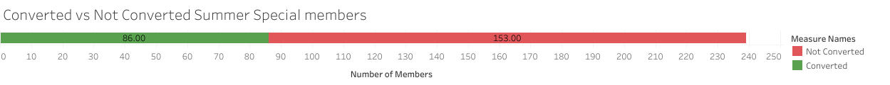
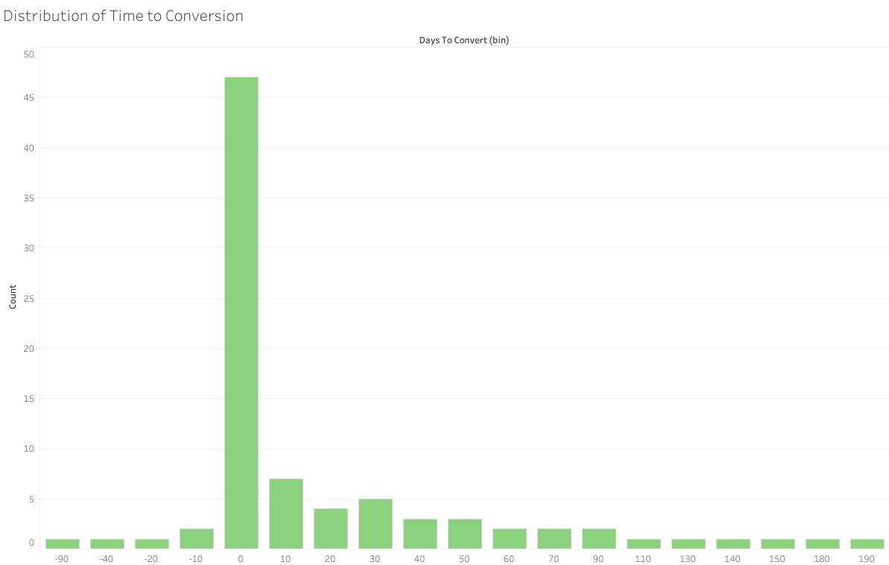

# Summer Special Conversion Analysis

## Overview
This project analyzes how effectively a 90-day Summer Special promotion converted members into active long-term memberships.

## Business Question
How many Summer Special purchasers converted into active members, and how long did it take them to convert after the promotional period ended?

## Tools Used
- SQL (BigQuery)
- Tableau
- Google Sheets

## Project Workflow
1. Built a member-level summary table from Summer Special purchase data
2. Joined Summer Special purchasers to current active membership data
3. Created a conversion flag
4. Calculated conversion rate
5. Measured time to convert after the 90-day promotion ended

## SQL Files
- `01_member_summary.sql` – creates a member-level analytical table
- `02_conversion_rate.sql` – calculates the overall conversion rate
- `03_days_to_convert.sql` – calculates average, minimum, and maximum days to convert

## Notes
Raw source data is not included in this repository. Member identifiers were anonymized for privacy and professionalism.

## Key Findings
- 36% of Summer Special purchasers converted into active memberships
- Average time to convert was 24 days after the 90-day contract ended
- Some members converted before the promotional period ended, shown by negative days_to_convert values

## Conversion Overview

This chart shows the number of Summer Special members who converted into active memberships compared to those who did not.

### Distribution of Time to Conversion

